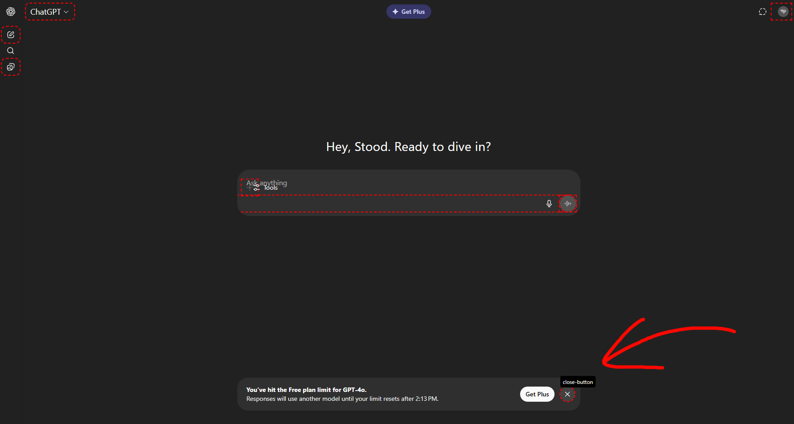
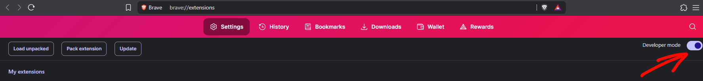
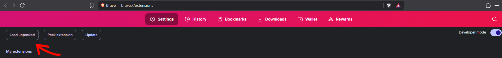
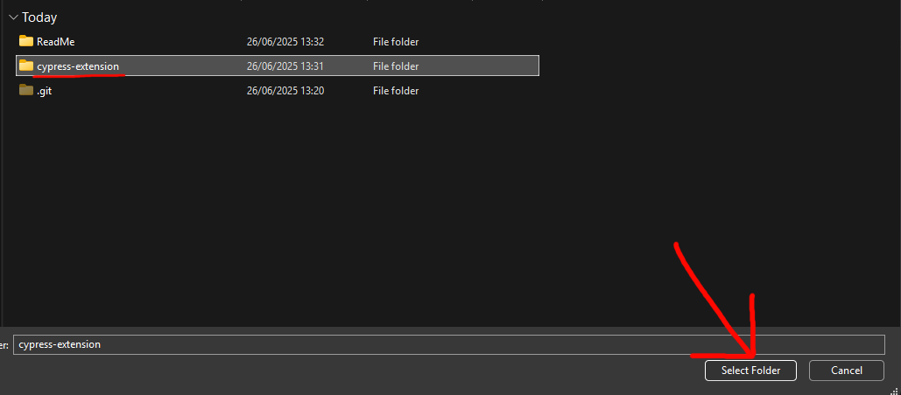

# How to install

## First download the cypress-extension.zip and unpack it somewhere

# Enabling Developer mode
goto chrome://extensions and click enable "Developer mode"

# Adding the extension
Click on "Load unpacked"

Then select the regular folder called "cypress-extension"

 
# Using the extension
If no mearkings appear just refresh the page

These markings will appear on every website with HTML objects with a "data-testid"

Upon hovering it will display the datatestid and clicking it copies it to clipboard